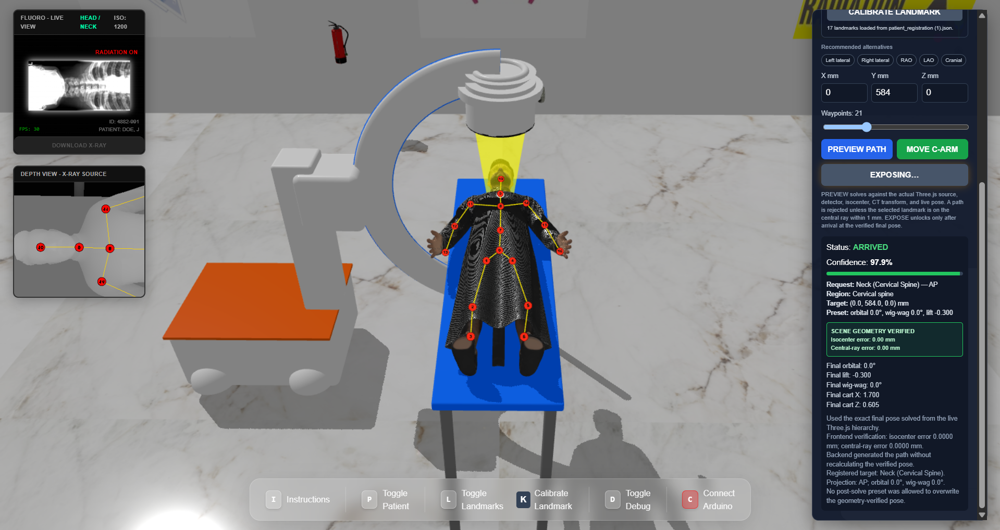

# AI-Guided C-Arm Positioning Simulator

<p align="center">
  <strong>Digital-twin research platform for anatomy-aware C-arm positioning, path planning, geometry verification, and simulated fluoroscopic acquisition.</strong>
</p>

<p align="center">
  <a href="https://c-armsim.com"><strong>Live Simulator</strong></a>
  ·
  <a href="docs/Home.md"><strong>Documentation</strong></a>
  ·
  <a href="docs/ARCHITECTURE.md">Architecture</a>
  ·
  <a href="docs/GETTING_STARTED.md">Getting Started</a>
  ·
  <a href="docs/RESEARCH_LIMITATIONS.md">Research Status</a>
</p>

<p align="center">
  
  
  
  
  
  
  
</p>

[](https://c-armsim.com)

<p align="center"><em>Live cervical-spine AP workflow: registered landmarks, planned C-arm pose, 97.9% planner confidence, scene-geometry verification, and simulated X-ray exposure.</em></p>

---

## Overview

This repository contains a research simulator for **AI-guided and geometry-aware C-arm positioning**. The system combines an interactive 3D digital twin, anatomical landmark targeting, automated pose solving, waypoint-based motion planning, geometry verification, and projection-specific simulated radiographic output.

The simulator explores a practical question in fluoroscopy-guided procedures: **can a C-arm be guided back to a desired anatomical view in a reproducible and explainable way while reducing unnecessary manual repositioning?**

> **Research use only.** This project is not a medical device, is not clinically validated, and must not be used for diagnosis, treatment, or patient care.

### Live demo

**https://c-armsim.com**

---

## Key Features

- Interactive 3D C-arm digital twin built with React and Three.js
- Anatomical landmark selection across the head, torso, upper extremities, and lower extremities
- AP, lateral, and selected oblique projection workflows
- Scene-geometry pose solving using the live Three.js hierarchy
- Waypoint-based C-arm motion planning
- Central-ray and isocenter geometry checks before exposure
- Backend confidence reporting and planning explanations
- Projection-specific reference-radiograph library for deterministic demo output
- Separate lightweight imaging service for fast deployment
- FastAPI planning and imaging services
- Dataset, model-training, evaluation, and analysis utilities
- Hardware-prototype and hardware-in-the-loop development assets

---

## Simulator Workflow

```text
Clinical imaging request
        │
        ▼
Select anatomy + projection
        │
        ▼
Select / calibrate anatomical landmark
        │
        ▼
Solve C-arm target pose from live 3D scene geometry
        │
        ▼
Verify isocenter + central-ray alignment
        │
        ▼
Generate waypoint path
        │
        ▼
Move digital C-arm
        │
        ▼
ARRIVED + geometry verification
        │
        ▼
EXPOSE X-RAY
        │
        ▼
Projection-specific simulated radiographic view
```

For the detailed workflow, see [`docs/SIMULATOR_WORKFLOW.md`](docs/SIMULATOR_WORKFLOW.md).

---

## System Architecture

```text
┌────────────────────────────── Browser / Vercel ──────────────────────────────┐
│                                                                              │
│  React UI                                                                    │
│    ├─ Anatomy + projection selection                                         │
│    ├─ Three.js digital twin                                                  │
│    ├─ Landmark registration                                                  │
│    ├─ C-arm kinematics                                                       │
│    ├─ Central-ray / isocenter verification                                   │
│    └─ Fluoro display                                                         │
│                                                                              │
└───────────────────────┬──────────────────────────┬───────────────────────────┘
                        │                          │
                        │ POST /plan               │ POST /synthetic-xray
                        ▼                          ▼
┌─────────────────────────────┐      ┌───────────────────────────────────────┐
│ Main Planning Service       │      │ Lightweight Imaging Service           │
│ Render                      │      │ Render                                │
│                             │      │                                       │
│ FastAPI                     │      │ FastAPI                               │
│ ├─ pose solving             │      │ ├─ anatomy/view normalization         │
│ ├─ waypoint planning        │      │ ├─ reference-radiograph resolver      │
│ ├─ confidence calculation   │      │ └─ deterministic image response       │
│ └─ optional DRR pipeline    │      │                                       │
└─────────────────────────────┘      └───────────────────────────────────────┘
```

For a deeper technical view, see [`docs/ARCHITECTURE.md`](docs/ARCHITECTURE.md).

---

## Anatomy and Projection Library

Projection-specific reference images are stored under:

```text
python/bridge/reference_xrays/
```

| Region | Examples | Views |
|---|---|---|
| Head / neck | Skull, cervical spine | AP, lateral |
| Torso | Chest, abdomen, pelvis | AP, lateral |
| Upper extremity | Shoulders, elbows, hands | AP, lateral, selected oblique |
| Lower extremity | Hips, knees, ankles | AP, lateral |

Reference selection is performed by the lightweight imaging API using normalized anatomy, laterality, and projection names.

**Important:** reference radiographs are demonstration assets, not a validated clinical dataset. Externally sourced images remain subject to their original licensing and redistribution terms.

---

## Geometry Verification

The planner supports a frontend-solved final pose that is checked against the live Three.js scene before the backend accepts it.

The current simulator uses a **1 mm internal scene-geometry acceptance threshold** for isocenter and central-ray alignment. This is an engineering constraint inside the simulator and **must not be interpreted as demonstrated clinical positioning accuracy**.

The backend can return:

- start and final C-arm pose
- interpolated path waypoints
- confidence components
- solver mode
- geometry-verification metadata
- human-readable planning explanation

---

## Repository Structure

```text
C-arm-guidance-simulator/
├── 3DVisualizer/
│   └── ciartic-app/               # React + Three.js simulator frontend
├── python/
│   └── bridge/
│       ├── api.py                  # Main planning / rendering FastAPI app
│       ├── synthetic_server.py     # Lightweight imaging-service entry point
│       ├── synthetic_xray.py       # Reference-radiograph resolver + API
│       ├── reference_xrays/        # Projection-specific reference images
│       └── planner/                # Pose solving, path planning, confidence
├── docs/
│   ├── Home.md                     # Documentation hub
│   ├── ARCHITECTURE.md             # Technical architecture
│   ├── GETTING_STARTED.md          # Local setup
│   ├── SIMULATOR_WORKFLOW.md       # End-to-end simulator workflow
│   ├── API.md                      # API reference
│   ├── RESEARCH_LIMITATIONS.md     # Evidence boundaries and limitations
│   └── images/                     # README / documentation screenshots
├── AI/                             # AI/inference-related development
├── src/                            # Training and evaluation code
├── assets/                         # Shared models/resources
├── data/                           # Datasets and prepared data
├── results/                        # Experimental outputs
├── logs/                           # Training/evaluation logs
├── Printed prototype/              # Physical-prototype assets
└── README.md
```

---

## Technology Stack

**Frontend:** React, Three.js, Vite, JavaScript  
**Backend:** Python, FastAPI, Uvicorn, NumPy / scientific Python utilities  
**Research / imaging:** PyTorch, DiffDRR, VTK / PyVista, medical-image processing and geometry tooling  
**Deployment:** Vercel frontend + Render planning and imaging services

---

## API Overview

### Planning service

```http
POST /plan
GET /health
```

### Lightweight imaging service

```http
POST /synthetic-xray
GET /synthetic-xray/health
```

See [`docs/API.md`](docs/API.md) for the API documentation.

---

## Running Locally

### Frontend

```bash
git clone https://github.com/SuhaimAlYafei/C-arm-guidance-simulator.git
cd C-arm-guidance-simulator/3DVisualizer/ciartic-app
npm install
npm run dev
```

### Main backend

```bash
pip install -r python/requirements.txt
cd python
uvicorn bridge.api:app --host 0.0.0.0 --port 8000
```

### Lightweight imaging backend

```bash
pip install -r python/requirements-synthetic.txt
cd python
uvicorn bridge.synthetic_server:app --host 0.0.0.0 --port 8001
```

For expanded setup notes, see [`docs/GETTING_STARTED.md`](docs/GETTING_STARTED.md).

---

## Research Status and Limitations

### Implemented

- interactive 3D C-arm simulation
- anatomical landmark targeting
- geometry-based final-pose verification
- automatic waypoint planning
- confidence/explanation output
- projection-specific radiographic reference mapping
- deployed web frontend and backend services

### In development / future validation

- quantitative evaluation against physical C-arm measurements
- broader hardware-in-the-loop validation
- systematic comparison with clinician positioning
- uncertainty calibration under real procedural conditions
- validated collision avoidance across representative operating-room configurations
- clinical-image and radiation-dose studies
- regulatory and safety evaluation

No claim of clinical accuracy, radiation reduction, diagnostic performance, or autonomous medical-device capability should be inferred from the current simulator.

See [`docs/RESEARCH_LIMITATIONS.md`](docs/RESEARCH_LIMITATIONS.md) for the full evidence and limitations statement.

---

## Documentation

Start at **[`docs/Home.md`](docs/Home.md)**.

- [Getting Started](docs/GETTING_STARTED.md)
- [Simulator Workflow](docs/SIMULATOR_WORKFLOW.md)
- [System Architecture](docs/ARCHITECTURE.md)
- [API Reference](docs/API.md)
- [Research Status & Limitations](docs/RESEARCH_LIMITATIONS.md)

---

## Acknowledgements

This project has been developed with guidance and support from mentors, clinicians, educators, and collaborators contributing to the broader research effort around AI-assisted medical imaging and C-arm positioning.

Third-party assets, libraries, datasets, and prior work remain subject to their respective licenses and attribution requirements.

---

## License

Repository software is distributed under the MIT License. Copyright notices for original contributors are preserved in [`LICENSE`](LICENSE). Third-party datasets, medical images, models, and assets may have separate licenses that are not granted by the repository license.
